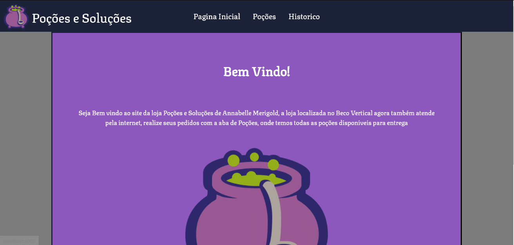
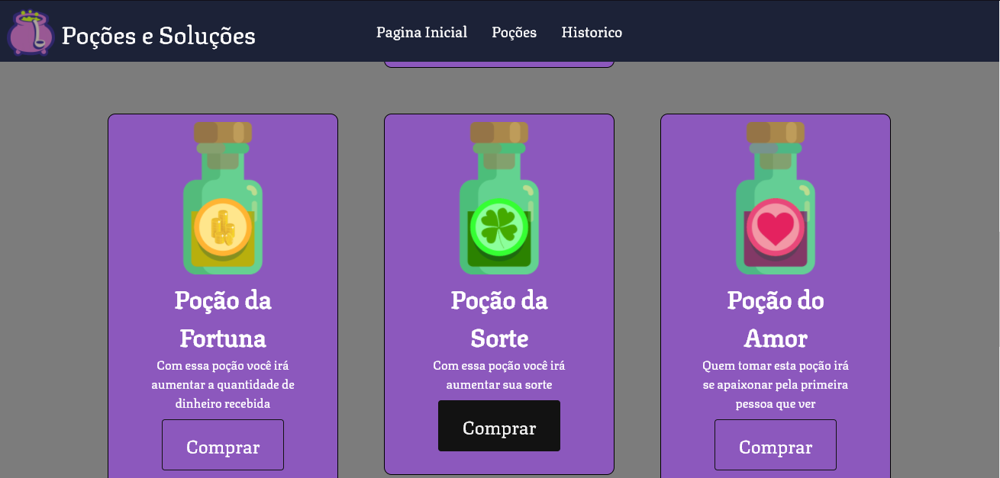
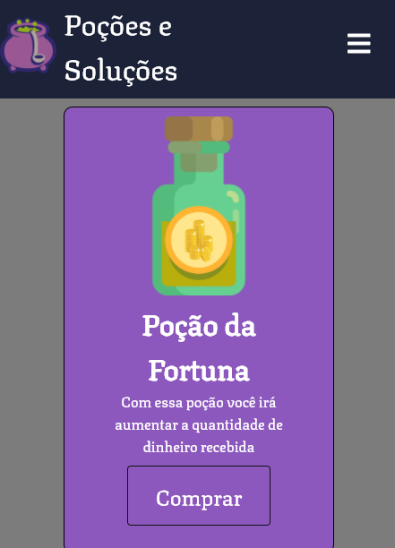
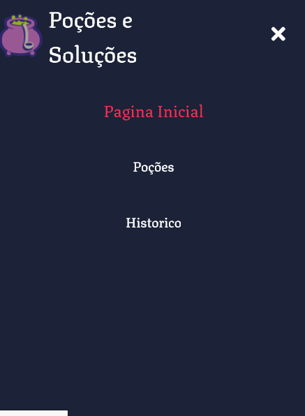
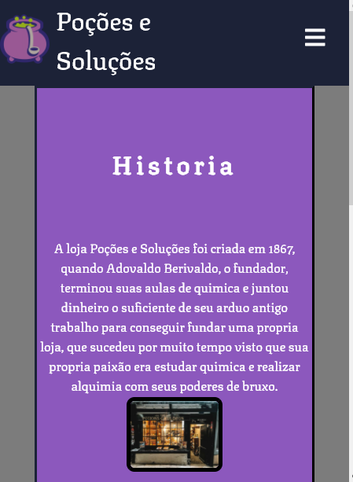
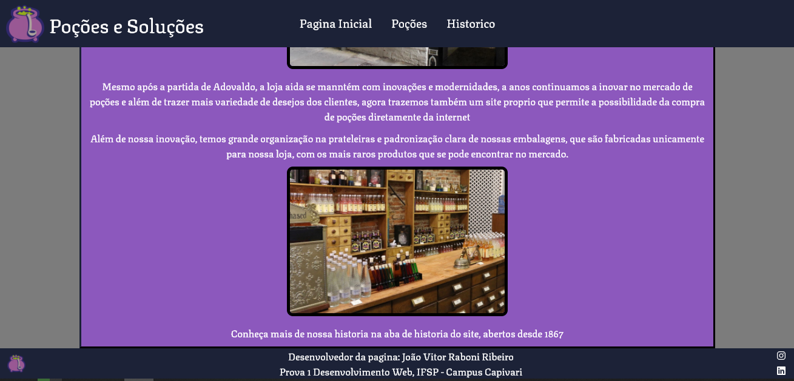

# <a href="https://jjokiba.github.io/WebDev-Test-1/" target="_blank">Potions & Solutions - Project Presentation</a>

This project were created using node.js and React with the purpose to understand better Its coding, the test on IFSP - web development was requesting an site to show up potions to a shop of potions, with 3 different pages to look up for, needed to be responsive and also needed to have a navbar, a main body and a footer. 
At the last, our teacher made a challenge of implementing an API that gets new potions to implement on our site, for that I was already fully setted(since I´ve created an generic component for the creation of the cards), I´ve just had to add AJAX for the Api consult and load of the parameters, and this is how my site became:

   	**At the end of this presentation there´s the text explaning how to run/create an React App**

 
This is the initial screen, I´ve made a generic text only to create this page.

 

 
This is the page made for the potions that are being sold, all of the images were eddited by me as it give an unique simple theme, on click in button "Comparar" there´s a modal that opens and displays an confirmation question for the buy

 

 
Here´s a print from the site in mobile mode, the navbar has a drawer where you can open and display the different pages that can be accessed

 

 
Here´s the "drawer" opened image 

 

 
Here´s the third page, where I´ve created an background story for the shop of potions

 

 
And finaly, here´s the footer created for the website

 

# Getting Started with Create React App

This project was bootstrapped with [Create React App](https://github.com/facebook/create-react-app).

## Available Scripts

In the project directory, you can run:

### `npm start`

Runs the app in the development mode.\
Open [http://localhost:3000](http://localhost:3000) to view it in the browser.

The page will reload if you make edits.\
You will also see any lint errors in the console.

### `npm test`

Launches the test runner in the interactive watch mode.\
See the section about [running tests](https://facebook.github.io/create-react-app/docs/running-tests) for more information.

### `npm run build`

Builds the app for production to the `build` folder.\
It correctly bundles React in production mode and optimizes the build for the best performance.

The build is minified and the filenames include the hashes.\
Your app is ready to be deployed!

See the section about [deployment](https://facebook.github.io/create-react-app/docs/deployment) for more information.

### `npm run eject`

**Note: this is a one-way operation. Once you `eject`, you can’t go back!**

If you aren’t satisfied with the build tool and configuration choices, you can `eject` at any time. This command will remove the single build dependency from your project.

Instead, it will copy all the configuration files and the transitive dependencies (webpack, Babel, ESLint, etc) right into your project so you have full control over them. All of the commands except `eject` will still work, but they will point to the copied scripts so you can tweak them. At this point you’re on your own.

You don’t have to ever use `eject`. The curated feature set is suitable for small and middle deployments, and you shouldn’t feel obligated to use this feature. However we understand that this tool wouldn’t be useful if you couldn’t customize it when you are ready for it.

## Learn More

You can learn more in the [Create React App documentation](https://facebook.github.io/create-react-app/docs/getting-started).

To learn React, check out the [React documentation](https://reactjs.org/).

### Code Splitting

This section has moved here: [https://facebook.github.io/create-react-app/docs/code-splitting](https://facebook.github.io/create-react-app/docs/code-splitting)

### Analyzing the Bundle Size

This section has moved here: [https://facebook.github.io/create-react-app/docs/analyzing-the-bundle-size](https://facebook.github.io/create-react-app/docs/analyzing-the-bundle-size)

### Making a Progressive Web App

This section has moved here: [https://facebook.github.io/create-react-app/docs/making-a-progressive-web-app](https://facebook.github.io/create-react-app/docs/making-a-progressive-web-app)

### Advanced Configuration

This section has moved here: [https://facebook.github.io/create-react-app/docs/advanced-configuration](https://facebook.github.io/create-react-app/docs/advanced-configuration)

### Deployment

This section has moved here: [https://facebook.github.io/create-react-app/docs/deployment](https://facebook.github.io/create-react-app/docs/deployment)

### `npm run build` fails to minify

This section has moved here: [https://facebook.github.io/create-react-app/docs/troubleshooting#npm-run-build-fails-to-minify](https://facebook.github.io/create-react-app/docs/troubleshooting#npm-run-build-fails-to-minify)
